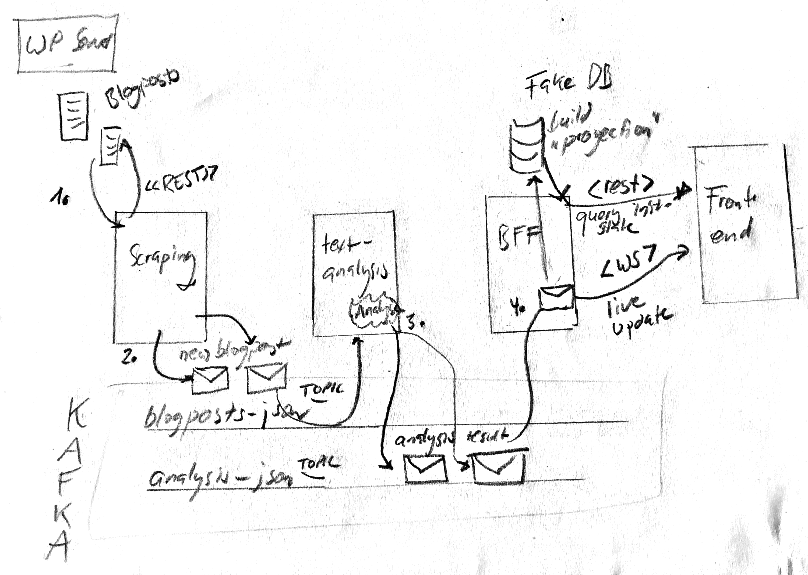

# Wordpress Realtime WordCount

This project scrapes a WordPress blog in regular intervals. It send it's blog posts through several Kotlin Spring Boot MicroServices that execute a word count analysis and feed it to a React Frontend. The Microservices communicate via Kafka and the frontend gets it's (realtime) data via Websocket and REST.

### Architecture
Here's some notes on the design decisions. 

How does this work? See Numbers 1-4 on the diagram:
1. `Scraping Service` periodically polls the WordPress Service for Blogposts via REST. Initially it retrieves all blogposts. Then it will just query for posts after the last date it found. New blogposts trigger our realtime processing chain.
2. Everytime there's a new blog post, be it on the initial ramp up or on subsequent updates, a `NewBlogPostPublished` event is send out via Kafka (on the topic `blogposts-json`). We chose different Kafka topic for different event types, to keep it nice and simple. The event contains a subset of what we retrieved
from the WordPress Server: The `id`, `date`, and `html content` of the post. We want to feed just the data we need into our system.
3. `Text analysis Service` picks up every one of the events publish on topic `blogposts-json` and does some magical computations. As a result it publishes `WordCountAnalysisResult` events.
4. `Bff` or backend for frontend, a service that provides the data we consume in our react frontend, receives the `WordCountAnalysisResult` event. Firstable it publishes the event directly to the frontend via Websocket, in case it is currently connected. This takes care of the live update our users would see. Then it also saves the event to a (fake) database - since we need an initial state for the web application. When it's started for the first time it will query it's state via REST and retrieve all the events `Bff` has saved to the database. The frontend takes care of deduplicating data - since we don't have `only-once` guarantees in our system.

Of course this super overmodelled and could easily be done in a dedicated node backend or maybe even just in the frontend.

### Project structure 
We did some basic DDD friendly moves to structure the project. We introduced folders `entities`, `infrastructure`,and `services`. We could easily move on and go with classical layers `infrastructure`, `application`, and `domain` in case we'd have some real domain logic going on. For now we have the different aspects seperated by folders and can easily recognize them.

In `scraping service` there are some notes in the code that hint how we can split down functionality some more. Check out the TODO comments to get some insights.

Regarding tests we only have the bare minimum tested, and no real integration tests or test of the infrastructure jet - which would be next on the menu.

### Possible improvements 
* Get this thing CI/CD ready
* Monitoring
* Write infrastructure tests (Kafka, REST Clients, etc.)
* Write true integration tests 
* Implement error handlers for the Kafka consumers (they will crash the application into a death loop if something goes wrong, e.g. with serialization/deserialization)
* Implement the TODOs
* Use fancier tech for doing the data transformations (e.g. Kafka Streams API - used bare Kafka here to keep it as simple as possible)
* Test for cases involving concurrency/scaling
* Scale it up, take care of the problems
* Connect some real DBs to this, probably Mongo
* Schemas for our Kafka Events (e.g. AVRO https://www.confluent.de/blog/avro-kafka-data/)

### Running the project
Do this [run scraping service last and with other services running if you don't wanna have to replay events]: 
* in project root: `docker-compose up -d`, make sure containers are up and running (ZK & kafka)
* \<start opening terminal tabs for each one of those; check that each one got its connection to Kafka\>
* gradle bootRun -p ./bff
* gradle bootRun -p ./textanalysis
* gradle bootRun -p ./scraping
* cd frontend; npm i; npm run start 

or run `make` in project root, if you feel lucky. You're probably not gonna be.

To make this it work we got to build and run several SpringBoot-Kotlin MicroServices plus the React Frontend. For communication via realtime messages we need Kafka. Easiest way is a Kafka docker image we pull and run using `docker-compose`.

#### Prerequisites
We need a few tools to run this, install the ones you don't have already

* Make
    `brew install make`

* Gradle
    `brew install gradle`

* node/npm 
    `https://nodejs.org/en/download/`

* Docker compose
    `https://docs.docker.com/compose/install/`

#### Acessing the interface
Hit `localhost:3000` in your browser and you should see our real time web interface.

Following ports are relevant for you:
| Service          | Port          | 
| ---------------- |:-------------:| 
| **react frontend** | **3000**    | 
| scraping service | 8081          | 
| bff              | 8080          | 
| Kafka            | 9093          | 

bff=backend for frontend, service that provides our frontend with data

#### Trouble shooting

* No data in frontend? Awwwww! <3
    * Well probably the bff wasn't running when scraping service was sending
    the blog post messages and they went through the pipeline. We don't have our system configured 
    to replay the kafka messages automatically when a new client connects, so you got to trigger that.

    * Fire off a GET request to the scraping services replay endpoint to make it send its messages again
    and get some data in bff:
    `curl --location --request GET 'localhost:8081/replay'`

* The microservices display some Kafka connection error blah?
    * Try removing your docker containers in the docker app and ramp up docker again using docker-compose.

* You're a curious cat and want to see the data the bff has in store for us? Totally understand!
    * Curl it: `curl --location --request GET 'localhost:8080/wordcount'`
